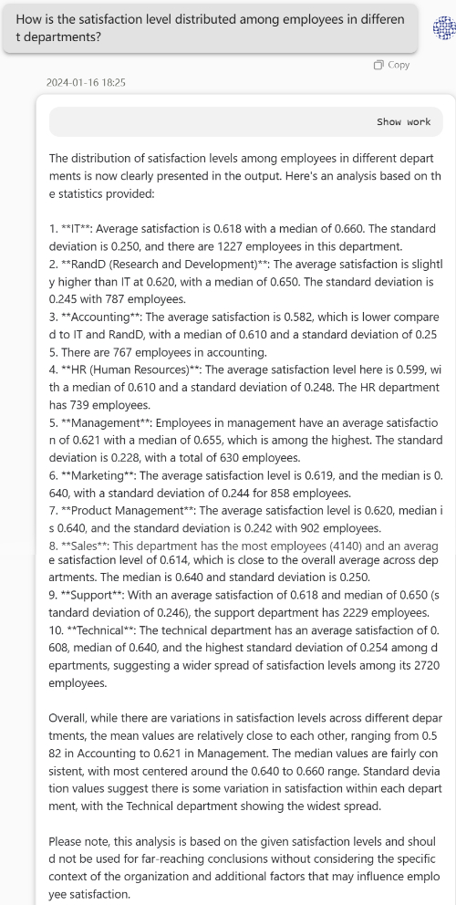
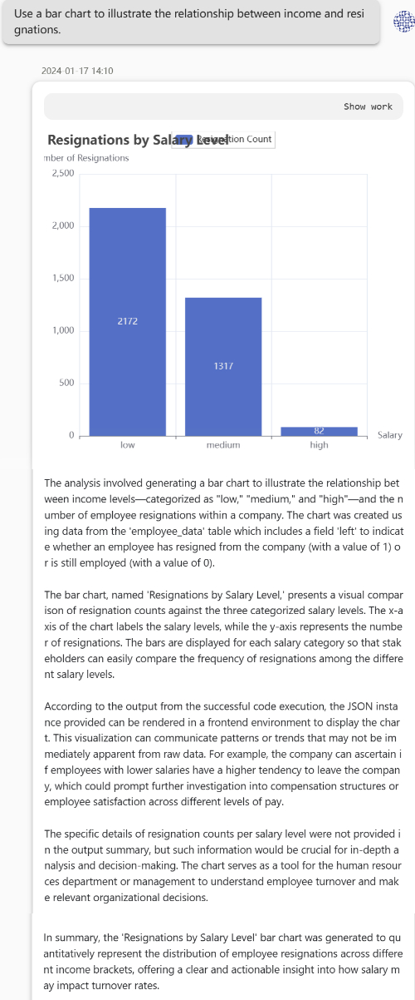
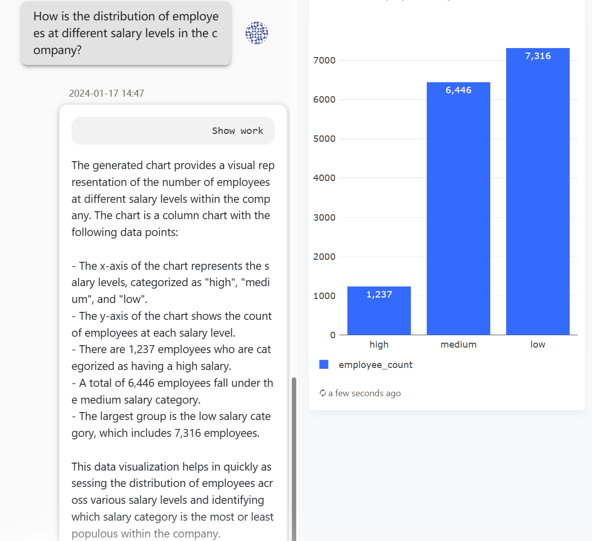
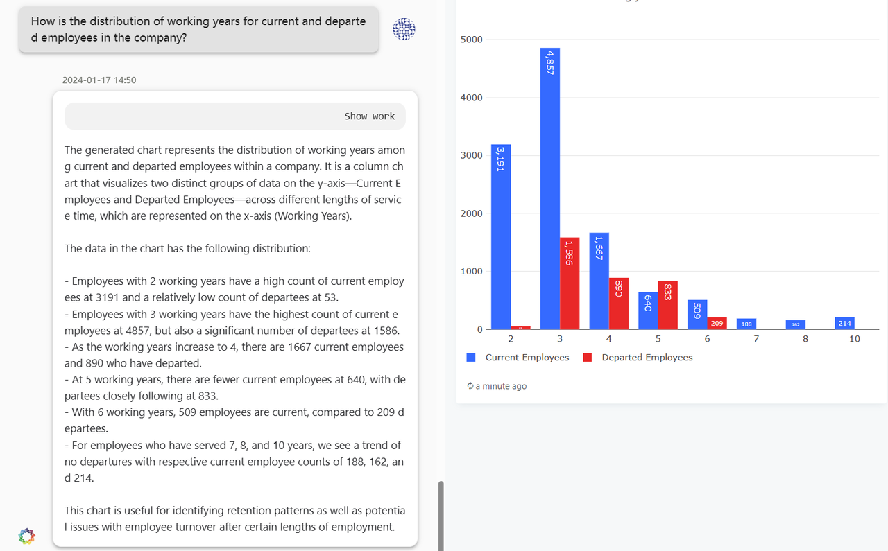
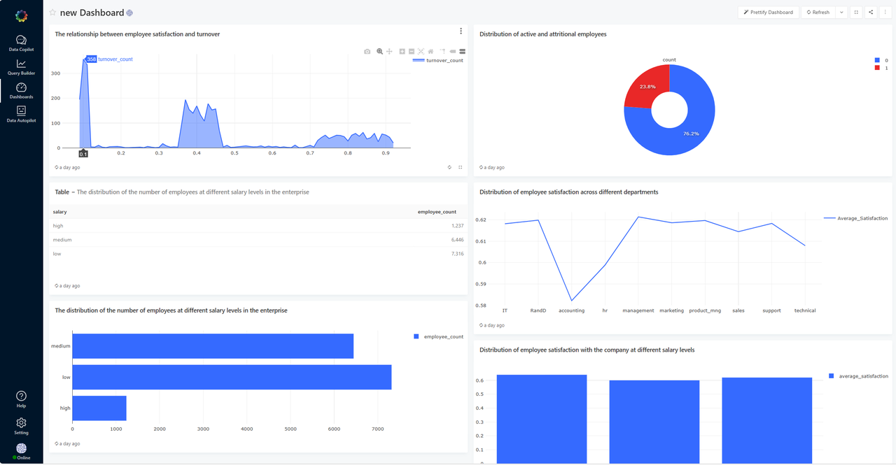

# 1. Background
 
  This dataset covers historical data of employees from a large company, including records of 15,002 employees. The data includes 10 fields such as employee satisfaction, performance evaluation, number of projects, monthly working hours, tenure, injuries, and employment status.
# 2. Introduction to DeepBI Platform
  
  The DeepBI platform provides functionalities such as assisting data analysis, generating reports, dashboards, and automated data analysis. It supports users in obtaining data results and analysis through conversation, generating persistent reports and visual graphics, assembling dashboards, and automatically completing comprehensive data analysis reports.
# 3. Test Purpose

  Analyze employee turnover rate, explore factors causing employee turnover, and propose recommendations to reduce the company's employee turnover rate.
# 4. Test Steps
## 4.1  Data Preparation

- Download the dataset, rename columns, remove null and outlier values to ensure data quality.
- The cleaned dataset contains 14,999 records.
## 4.2  Assisted Data Analysis

## 4.3 Query Builder

## 4.4 Dashboards

# 5. Test Results and Analysis

- Identified that the turnover rate is higher for employees with 3-6 years of tenure compared to the average turnover rate, further analysis is conducted.
- Compared the characteristics of employees with 3-6 years of tenure who left and those who stayed, finding factors such as low satisfaction, poor performance evaluation, and longer working hours influencing turnover rate.
# 6. Conclusion

- Factors like employee satisfaction, performance evaluation, and working hours have a significant correlation with turnover rate. It is recommended for the company to take measures to reduce employee turnover.
- Suggestions include adjusting salary structures, focusing on satisfaction, and improving performance evaluations to lower employee turnover rate.
# 7. Appendix

  Attached with detailed information such as cleaned sample data and screenshots of generated reports/dashboards.

  Cleaned Data Sample:
[HR_comma_sep.zip](./data/HR_comma_sep.zip)

  Generated Report/Dashboard Screenshots:
[HR_comma_sep/pdf/Answer successfully.pdf](./pdf/All%20case%20screenshots.pdf)

🔍 For more detailed information or to begin hands-on exercises, please visit our [DeepData repository](https://github.com/DeepInsight-AI/DeepData) and refer to the corresponding [documentation](https://deepthought.feishu.cn/wiki/space/7323090769442193412?ccm_open_type=lark_wiki_spaceLink&open_tab_from=wiki_home). Wishing you success in your journey of data analysis!