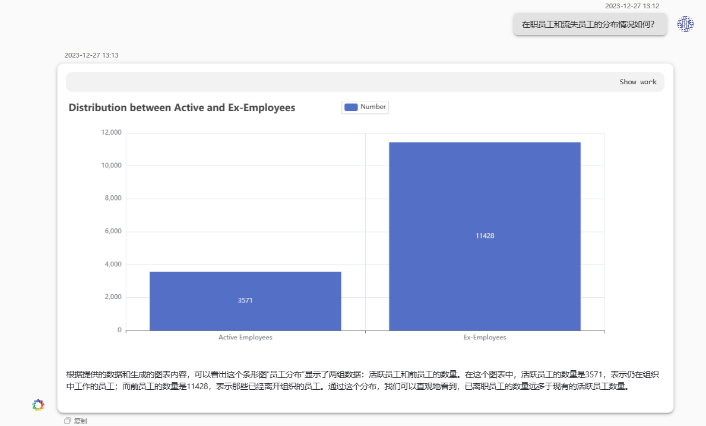
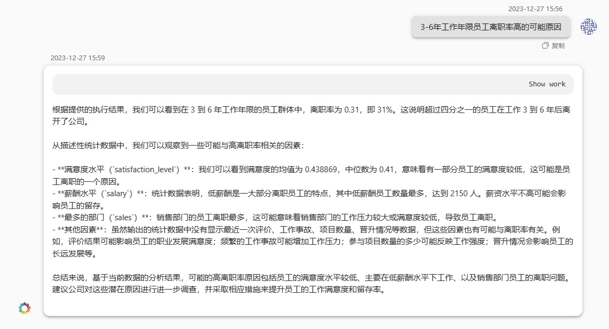
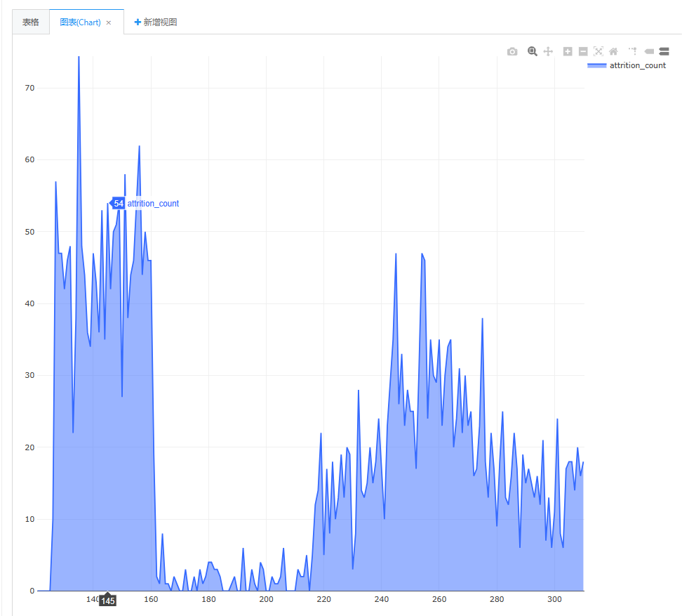
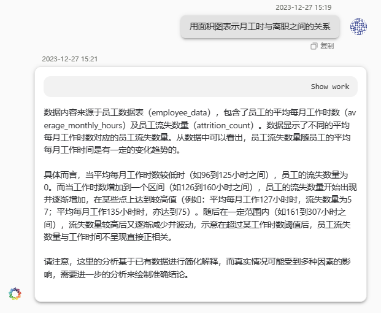
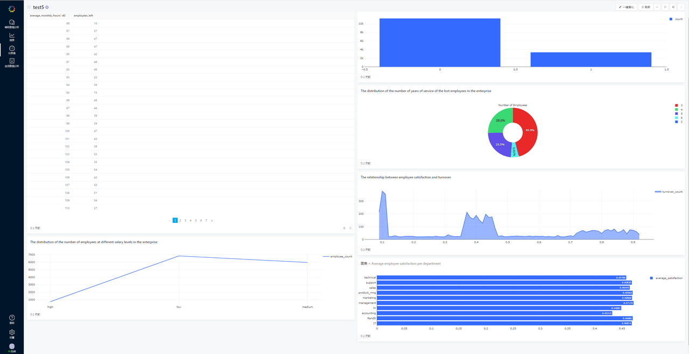
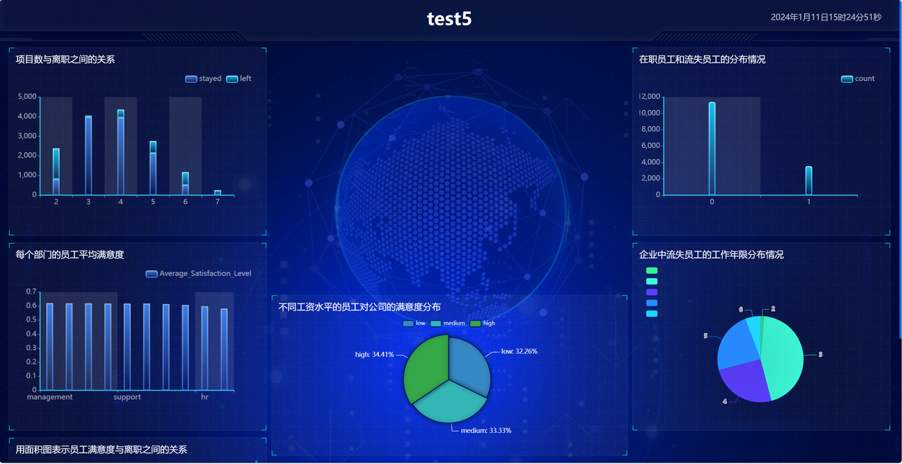

# 1.背景
 
  本数据集涵盖一家大公司的员工历史数据，包括15,002名员工的记录。数据涵盖了员工满意度、绩效评估、项目数、月工作时长、司龄、工伤情况、离职状态等10个字段。
# 2. DeepBI平台简介

  DeepBI平台提供辅助数据分析、报表、仪表盘和自动数据分析等功能，支持用户通过对话获取数据结果和分析、生成持久化的报表和可视化图形、组装为仪表板，并能自动完成完整的数据分析报告。
# 3. 测试目的

   分析员工流失率，探索导致员工流失的因素，并提出降低公司员工流失率的建议。
# 4. 测试步骤
## 4.1 数据准备

- 下载数据集并进行列重命名，删除空值和异常值，确保数据质量。
- 清洗后的数据集包含14,999条记录。
  点击下方即可下载我们清洗后的数据：
  [HR_comma_sep.zip](./data/HR_comma_sep.zip)
## 4.2 辅助数据分析

点击下方下载查看更多截图：
[HR_comma_sep/pdf/案例全部截图.pdf](./pdf/案例全部截图.pdf)
## 4.3 报表生成

## 4.4 仪表盘创建

# 5. 测试结果与分析

- 发现3-6年司龄员工流失率高于平均流失率，进行进一步分析。
- 对比了3-6年司龄员工的流失和未流失人员的特征，发现满意度较低、绩效评估差、工作时长长等因素影响了流失率。
# 6. 结论
 
  - 员工满意度、绩效评估、工作时长等因素与流失率相关性较高，建议公司采取相应措施降低员工流失率。
- 提出调整薪酬结构、关注满意度、改进绩效评估等建议以降低员工流失率。
# 7. 附录
   
附有清洗后数据样本、生成的报表/仪表板截图等其他补充信息，以便更详细地展示分析过程和结果。

清洗后数据样本：
[HR_comma_sep.zip](./data/HR_comma_sep.zip)

生成的报表/仪表板截图：
[HR_comma_sep/pdf/案例全部截图.pdf](./pdf/案例全部截图.pdf)

🔍如需更详细的信息或开始动手练习，请访问我们的 [DeepData 存储库](https://github.com/DeepInsight-AI/DeepData)并参考相应的[文档](https://deepthought.feishu.cn/wiki/space/7323065464401477635?ccm_open_type=lark_wiki_spaceLink&open_tab_from=wiki_home)。祝您在数据分析之旅中取得成功！