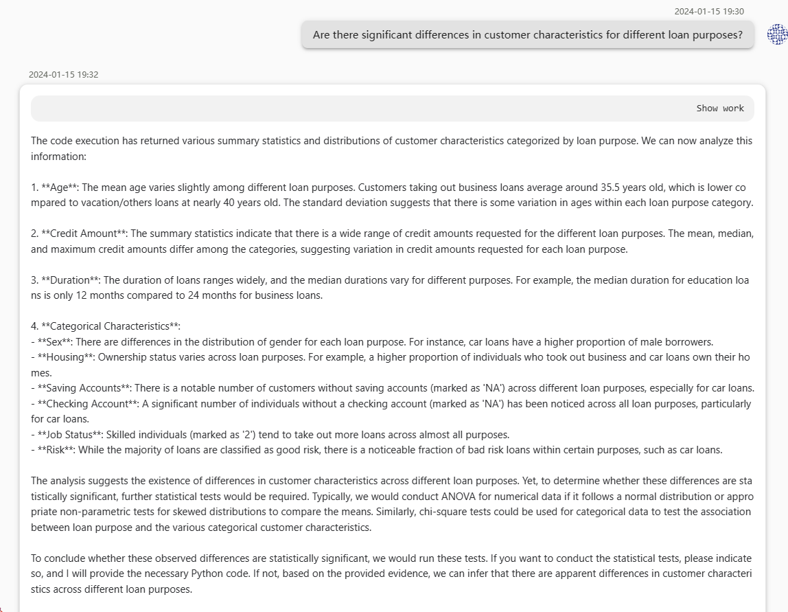
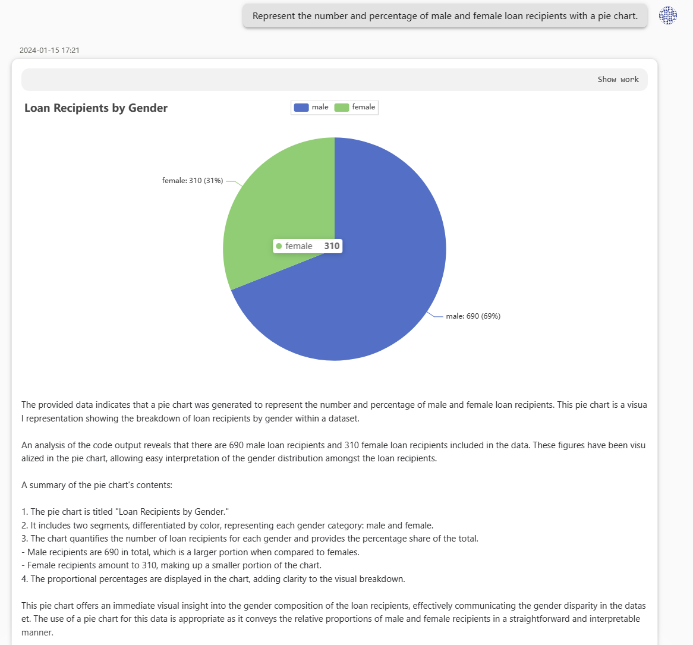
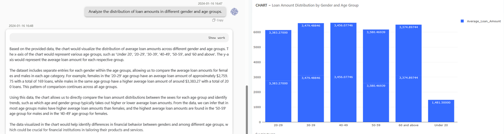
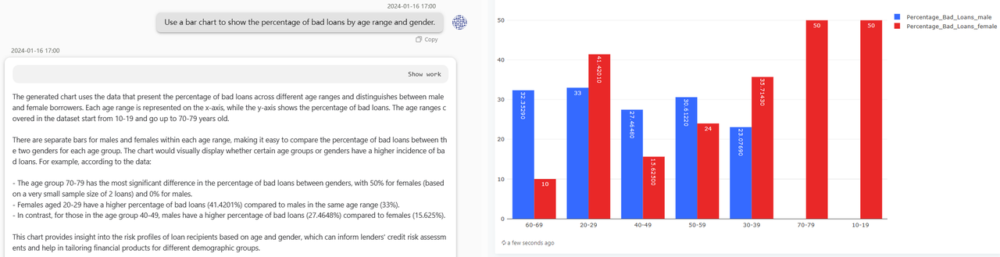

# 1. Background
 
  As one of the crucial operations for commercial banks, loans play an indispensable role, with personal loans holding a significant position. In order to better understand the characteristics of individual loan customers, we conducted data analysis using credit risk data from German individuals available on the Humpback Community.
# 2. Introduction to DeepBI Platform
  
  The DeepBI platform provides us with a comprehensive set of data analysis tools, including auxiliary data analysis, report generation, dashboard creation, and automated data analysis functions. These features will assist us in exploring data more effectively and drawing meaningful conclusions.
# 3. Test Purpose

  The purpose of this test is to conduct in-depth data analysis through the DeepBI platform, revealing the characteristics of individual loan customers, loan trends, and risk factors, to provide accurate business decision support for the bank.
# 4. Test Steps
## 4.1  Data Preparation

  Prepare data by downloading German credit risk data from the Humpback Community.
## 4.2  Assisted Data Analysis

## 4.3 Query Builder

# 5. Test Results and Analysis

  Through the auxiliary data analysis of the DeepBI platform, we successfully obtained detailed information about individual loan customers. Overall, we found that individuals aged 20-40 are the main force behind loans.

  Analysis of non-performing loans shows that among the age group of 20-50, males are the majority, while females tend to be more cautious. For individuals more alert to overdraft risks, financial institutions need to conduct more detailed investigations into income and deposit situations in credit operations.

  In the analysis of job skills and loan purposes, loans for high-skilled workers have higher total amounts, focusing primarily on automobiles, housing, and home appliances, reflecting people's pursuit of improving their quality of life.
# 6. Conclusion

  Through this test, the DeepBI platform has demonstrated excellent performance in the analysis of personal loan data. Its auxiliary data analysis, report generation, dashboard creation, and automated data analysis functions provide users with convenient and efficient data analysis tools, offering powerful support for banking business decisions and precise marketing.
# 7. Appendix

- Cleaned data samples
- Screenshots of generated reports/dashboards
- Additional supplementary information

  Cleaned Data Sample:
[german_credit_data.zip](./data/german_credit_data.zip)

  Generated Report/Dashboard Screenshots:
[german_credit/pdf/Answer successfully.pdf](./pdf/Answer%20successfully.pdf)

🔍 For more detailed information or to begin hands-on exercises, please visit our [DeepData repository](https://github.com/DeepInsight-AI/DeepData) and refer to the corresponding [documentation](https://deepthought.feishu.cn/wiki/space/7323090769442193412?ccm_open_type=lark_wiki_spaceLink&open_tab_from=wiki_home). Wishing you success in your journey of data analysis!