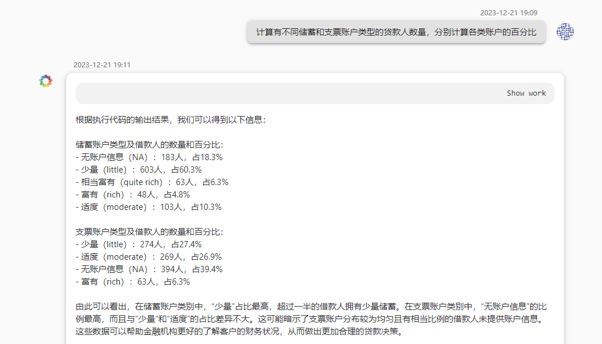
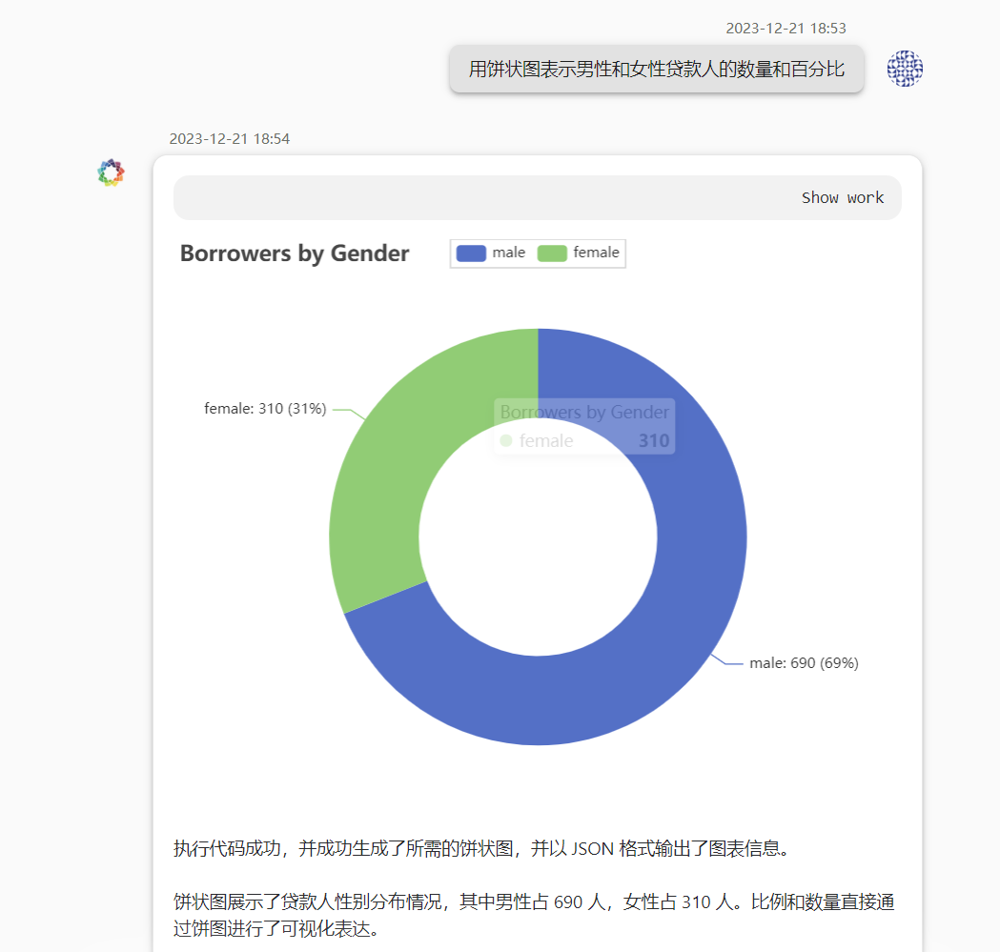

# 1.背景
 
  贷款作为商业银行的重要业务之一，个人贷款在其中占据不可或缺的地位。为了更好地了解个人贷款客户的特征，我们进行了数据分析，数据来源于和鲸社区的德国人信贷风险数据。
# 2. DeepBI平台简介

  DeepBI平台为我们提供了丰富的数据分析工具，包括辅助数据分析、报表生成、仪表盘创建和自动数据分析等功能。这些功能将帮助我们更有效地探索数据并得出有意义的结论。
# 3. 测试目的

  本次测试的目的是通过DeepBI平台进行深度数据分析，从而揭示个人贷款客户的特征、贷款趋势以及风险因素，为银行提供精准的业务决策支持。
# 4. 测试步骤
## 4.1 数据准备

  数据准备从和鲸社区下载德国人信贷风险数据。
  点击下方即可下载我们清洗后的数据：
  [german_credit_data.zip](./data/german_credit_data.zip)
## 4.2 辅助数据分析

点击下方下载查看更多截图：
[成功回答.pdf](./pdf/案例全部截图.pdf)
# 5. 测试结果与分析

  通过DeepBI平台的辅助数据分析，我们成功获取了关于个人贷款客户的详细信息。总体上，我们了解到20-40岁的人是贷款的主力军。

  不良贷款分析显示，20-50岁的人群中，男性占多数，女性相对更谨慎。对于透支风险更为警觉的人，金融机构在信贷业务中需要更加细致的调查工作收入和存款情况。

  在工作技能-贷款目的分析中，高技能工作者的贷款总额较高，贷款目的主要集中在汽车、住房和家居设备，反映了人们对提高生活质量的追求。
# 6. 结论
 
  通过本次测试，DeepBI平台在个人贷款数据分析方面表现出色。其辅助数据分析、报表生成、仪表板创建和自动数据分析等功能为用户提供了便捷而高效的数据分析工具。对于银行业务决策和精准营销提供了有力支持。
# 7. 附录
   
- 清洗后数据样本
- 生成的报表/仪表板截图
- 其他补充信息

清洗后数据样本：
[german_credit_data.zip](./data/german_credit_data.zip)
生成的报表/仪表板截图：
[成功回答.pdf](./pdf/案例全部截图.pdf)

🔍如需更详细的信息或开始动手练习，请访问我们的 [DeepData 存储库](https://github.com/DeepInsight-AI/DeepData)并参考相应的[文档](https://deepthought.feishu.cn/wiki/space/7323065464401477635?ccm_open_type=lark_wiki_spaceLink&open_tab_from=wiki_home)。祝您在数据分析之旅中取得成功！