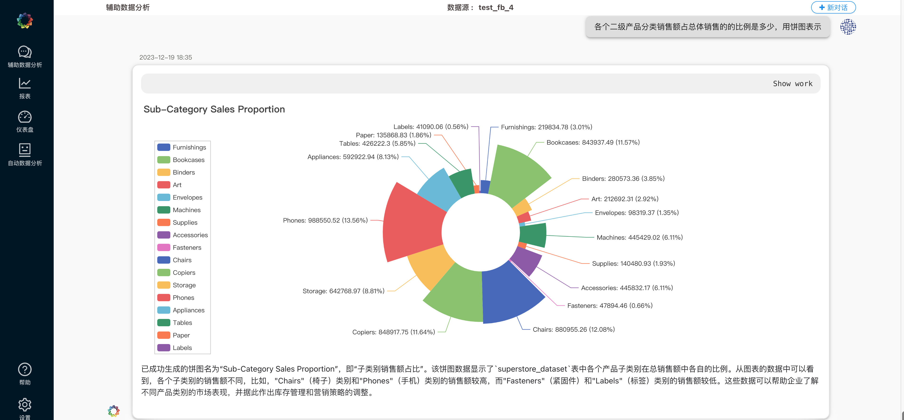
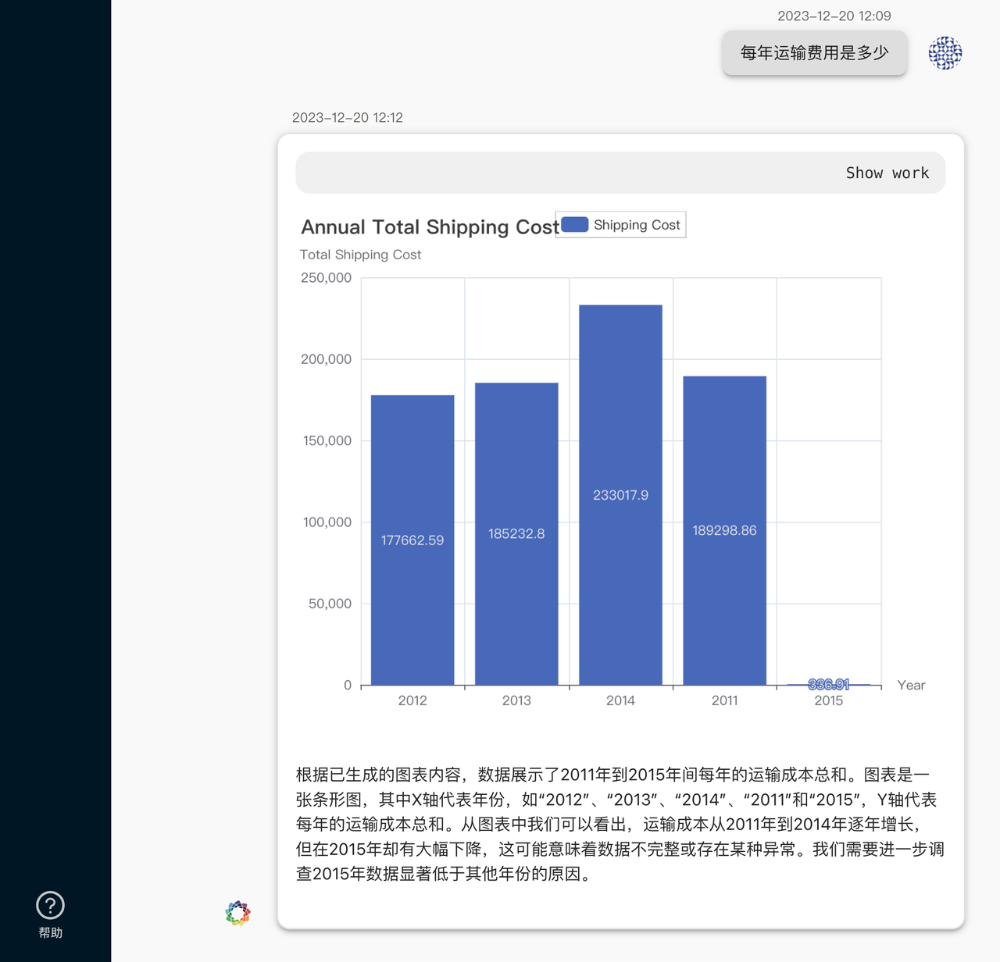

# 1.背景
 
  本数据分析报告基于线上商城的经营数据，通过DeepBI平台对日常运营进行实时监测和分析。数据来自kaggle的公开数据集“superstore_data”，包含超市零售数据，共51263条记录。分析的目的是建立经营分析平台，实现对公司全球历年销售数据的自动提取、清理和可视化分析。
# 2. DeepBI平台简介

 DeepBI是一款强大的数据分析平台，具备辅助数据分析、报表、仪表盘和自动数据分析等核心功能。它能够提高数据分析的效率和可视化效果，为企业提供全面的数据洞察。
# 3. 测试目的

  此次数据分析测试的目的是验证DeepBI平台在处理线上商城销售数据时的效果，包括数据的探索性分析、可视化效果以及自动数据分析的准确性和便捷性。
# 4. 测试步骤
## 4.1 数据准备

  首先，我们获取了来自kaggle的“superstore_data”数据集，并进行了基础表的关联，新建了复购率和RFM表，为后续分析做好数据准备工作。
## 4.2 辅助数据分析

# 5. 测试结果与分析

  通过DeepBI平台的分析，我们得出了以下结论：
  
- 公司2022年销售额同比增长26.1%，毛利额同比增长23.5%。
- Technology类别为销售额最高的品类，占比37.7%，且毛利额占比46%。
- 客户类型为consumer的销售额最高，占比近50%。    
- RFM分析显示，重要价值客户数量最多，占比26.3%，销售额占比近40%。
# 6. 结论
 
  DeepBI平台在此次数据分析测试中展现出了强大的功能和效果。其辅助数据分析、报表生成、仪表板创建和自动数据分析功能为用户提供了高效的数据分析体验。新引入的AI智能美化大屏功能增强了报表的视觉吸引力。总体而言，DeepBI平台在处理线上商城销售数据方面表现出色。
# 7. 附录
   
附有清洗后数据样本、生成的报表/仪表板截图等其他补充信息，以便更详细地展示分析过程和结果。

清洗后数据样本：
[superstore_data.zip](./data/superstore_data.zip)

生成的报表/仪表板截图：
[superstore/pdf/回答成功.pdf](./pdf/回答成功.pdf)

🔍如需更详细的信息或开始动手练习，请访问我们的 [DeepData 存储库](https://github.com/DeepInsight-AI/DeepData)并参考相应的[文档](https://deepthought.feishu.cn/wiki/space/7323065464401477635?ccm_open_type=lark_wiki_spaceLink&open_tab_from=wiki_home)。祝您在数据分析之旅中取得成功！